# Wireshark Analysis: Incident at Bartell Ltd

## Executive Summary
**Incident Overview:** A user at Bartell Ltd triggered a malicious macro by enabling content in a Word document attached to a phishing email. This initiated a multi-stage infection chain, leading to full host compromise, command and control (C2) establishment, and the system being used for malicious spam (malspam) operations.

**Key Findings & Attack Chain:**
1.  **Initial Access & Execution:** The victim host (`10.9.23.102`) downloaded a ZIP archive (`documents.zip`) from the malicious domain `attirenepal.com`. The archive contained a weaponized Excel file (`chart-1530076591.xls`), which was executed.
2.  **C2 Infrastructure & Persistence:** The infection established persistent C2 channels with multiple servers associated with the Cobalt Strike framework (`survmeter.live`, `securitybusinpuff.com`), identified by characteristic beaconing patterns and threat intelligence correlation.
3.  **Post-Compromise Activity:** The attacker performed discovery by checking the victim's external IP via `api.apify.org` and leveraged the compromised host to send malspam from a hijacked email account (`cristianodummer@cultura.com.br`).

## Scenario (Real-life Incident)
Eric Fischer from the Purchasing Department at Bartell Ltd received an email from a known contact with a Word document attachment. Upon opening the document, he clicked **"Enable Content."** The SOC Department immediately received an alert from the endpoint agent that Eric's workstation was making suspicious outbound connections. The packet capture (pcap) was retrieved from the network sensor and handed over for analysis.

**Objective:** Investigate the packet capture and uncover the malicious activities.

## Tools & Technologies Used
*   **Wireshark** (Primary Analysis Tool)
*   **VirusTotal** (Threat Intelligence)

## Methodology & Findings

### 1. Initial Malicious Download Analysis
*   **First Step:** Identified the first suspicious HTTP connection using the filter: `http`.
*   **Key Packet:** Located Packet No. **1735**, a GET request to malicious IP `85.187.128.24` at **Sep 24, 2021 16:44:38**.

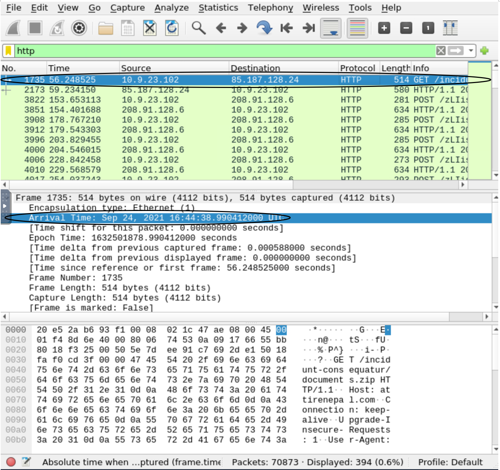

*   **Downloaded File:** Determined the file `documents.zip` was downloaded to victim host `10.9.23.102`.
*   **Malicious Domain:** From packet bytes, identified the hosting domain as **`attirenepal.com`**.
*   **File Export:** Used `File -> Export Objects -> HTTP…` in Wireshark to extract `documents.zip`. The archive contained one file: **`chart-1530076591.xls`**. This file can be validated as malicious by submitting its SHA-256 hash into threat intelligence platforms e.g VirusTotal.
*   **Web Server Info:** Analysed the HTTP response header: Server was **`LiteSpeed`** running **`PHP/7.2.34`**.

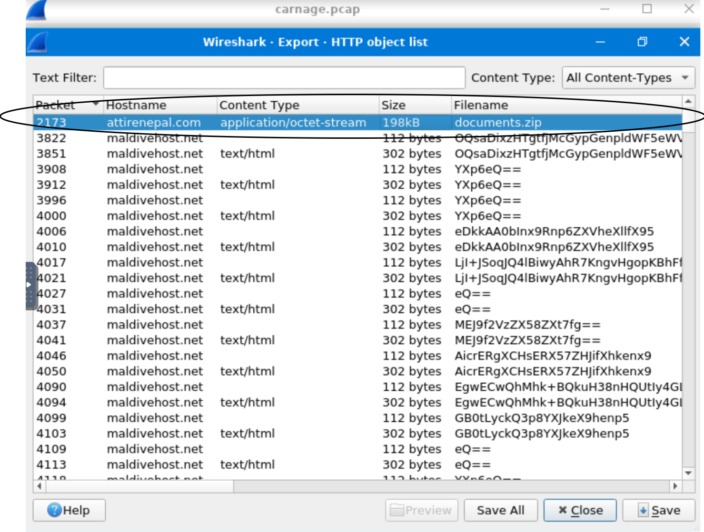

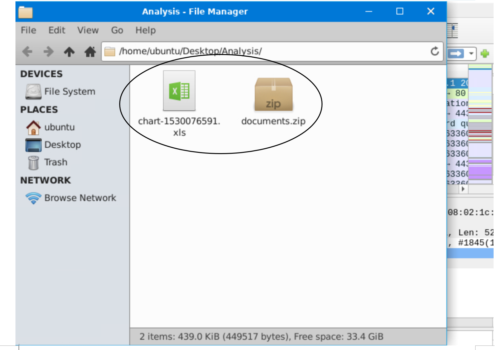

### 2. HTTPS Traffic & Encrypted Downloads
*   **Filter Applied:** `(tls) && (tls.handshake.type == 1)` to inspect TLS `Client Hello` packets.
*   **Timeframe Focus:** Analysed traffic between **Sep 24, 2021 16:45:11 - 16:45:30**.
*   **Domains Contacted:** Extracted a list of server names (SNI) from the handshake packets.
*   **Threat Intel Validation:** Used VirusTotal to identify three malicious domains from the list:
    *   `finejewels.com.au`
    *   `thietbiagt.com`
    *   `new.americold.com`
*   **Certificate Analysis:** For `finejewels.com.au`, found the issuing Certificate Authority in the `Server Key Exchange` packet to be **GoDaddy**.

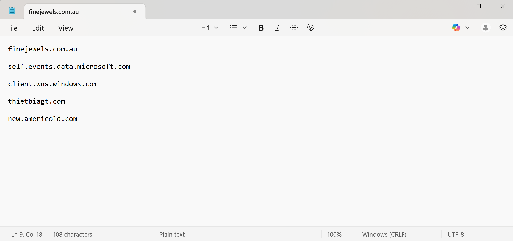

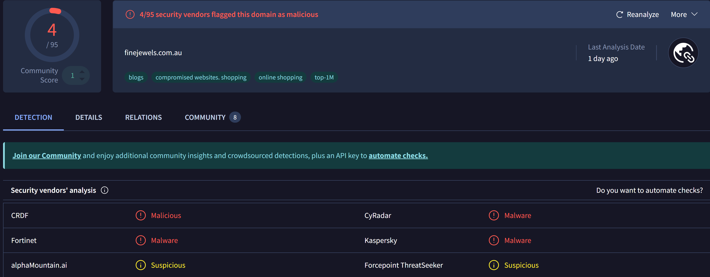

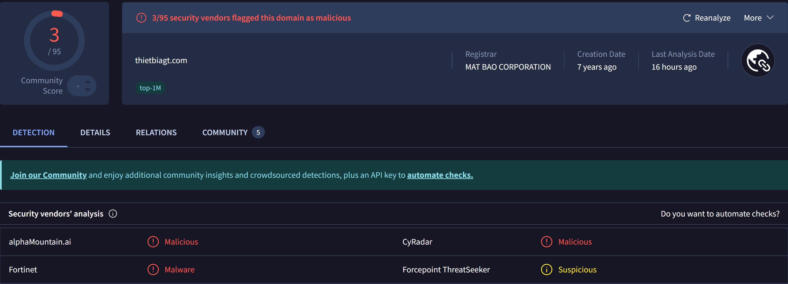

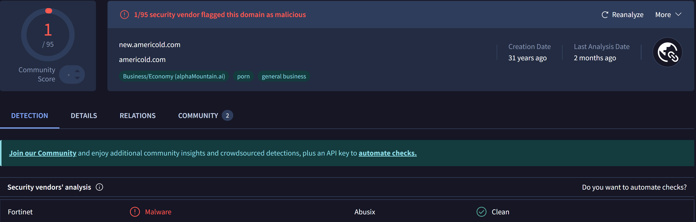

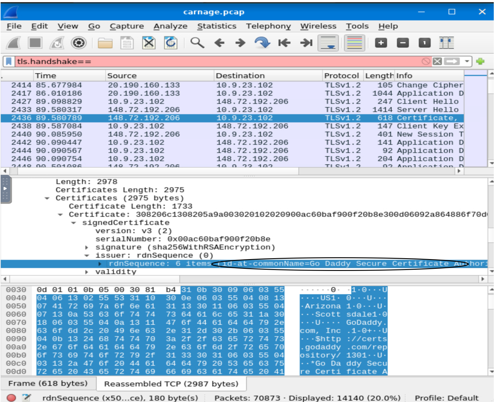

### 3. Command & Control (C2) Server Identification
*   **HTTP Filter:** Re-applied `http` to hunt for C2 traffic.
*   **Suspicious IP 1:** `185.106.96.158`
    *   **Activity:** GET requests to URI `/gscp.R/[large_randomized_string]` (mimicking Google Chrome).
    *   **Domain:** `survmeter.live` (from DNS query).
    *   **VirusTotal:** Confirmed as a **Cobalt Strike** server.
    *   **Host Header:** `ocsp.verisign.com` (attempted masquerading).

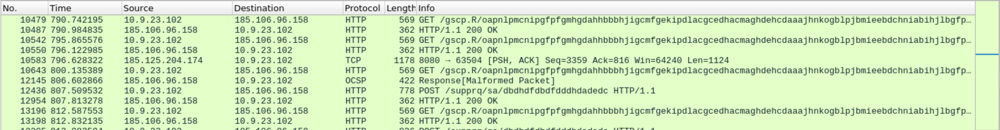

*   **Suspicious IP 2:** `185.125.204.174`
    *   **Activity:** Frequent `PSH, ACK` packets with high length (`Len=1460`) and entropy.
    *   **Domain:** `securitybusinpuff.com`.
    *   **VirusTotal:** Confirmed as a **Cobalt Strike** server.

*   **Additional C2:** IP `208.91.128.6` (domain `maldivehost.net`).
    *   **Activity:** High-entropy POST requests (e.g., `/zLIisQRWZI9/OQsaDixzHTgtfjMcGypGenpldWF5eWV9f3k=`).
    *   **Server Header:** `Apache/2.4.49 (cPanel) OpenSSL/1.1.1l mod_bwlimited/1.4`.

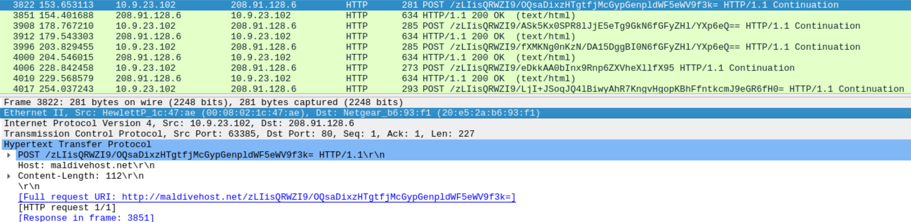

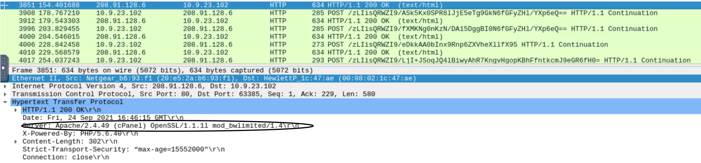

### 4. Post-Compromise Activity
*   **Victim Discovery:** The attacker used `api.apify.org` to check the victim's external IP address (**2021-09-24 17:00:04**).
*   **Malicious Spam (Malspam):**
    *   Identified **1439 SMTP packets**.
    *   Initial attempts from `farshin@mailfa.com`.
    *   **Successful Compromise:** Attacker sent malspam from the hijacked account **`cristianodummer@cultura.com.br`**.

## MITRE ATT&CK Summary
| Tactic | Technique | Evidence |
| :--- | :--- | :--- |
| **Initial Access** | **T1566.001** - Phishing: Spearphishing Attachment | Download of `documents.zip` via email. |
| **Execution** | **T1204.002** - User Execution: Malicious File | Victim execution of `chart-1530076591.xls`. |
| **Persistence & C2** | **T1573.002** - Encrypted Channel | HTTPS C2 traffic to Cobalt Strike servers. |
| | **T1071.001** - Application Layer Protocol: Web Protocols | HTTP/S beaconing to `survmeter.live`, `securitybusinpuff.com`. |
| **Defense Evasion** | **T1036** - Masquerading | C2 server using host header `ocsp.verisign.com`. |
| **Discovery** | **T1590** - Gather Victim Network Information | IP check via `api.apify.org`. |
| **Impact** | **T1566** - Phishing | Malspam sent from `cristianodummer@cultura.com.br`. |

## Conclusion
The victim was compromised via a spearphishing email, leading to a multi-stage malware deployment. The attacker established encrypted C2 channels using Cobalt Strike infrastructure, conducted network discovery, and weaponised the infected host for email-based propagation (malspam). The analysis of the packet capture provided a complete narrative, from initial access to final impact.

## Overall Takeaways
*   **Network Traffic Tells the Full Story:** This investigation traced the complete intrusion lifecycle—delivery, execution, C2, discovery, and offensive action—demonstrating that comprehensive attack chains are often visible in network data.
*   **Critical Analysis of Encrypted Traffic:** Moving beyond HTTP to analyse TLS handshakes and correlate with threat intelligence was essential to uncover hidden malicious connections (`finejewels.com.au`).
*   **Threat Intelligence Provides Certainty:** Platforms like VirusTotal transformed suspicious indicators (IPs, domains) into high-confidence findings, precisely identifying adversary tools (Cobalt Strike) and infrastructure.
*   **Deep Packet Analysis Yields Tactical Intel:** Inspecting specific protocol fields (Server headers, TLS certificates, SMTP streams) revealed crucial attacker details, from server software to the specific compromised email account used for impact.
---
**Back to Project Overview:** [README.md](README.md)
